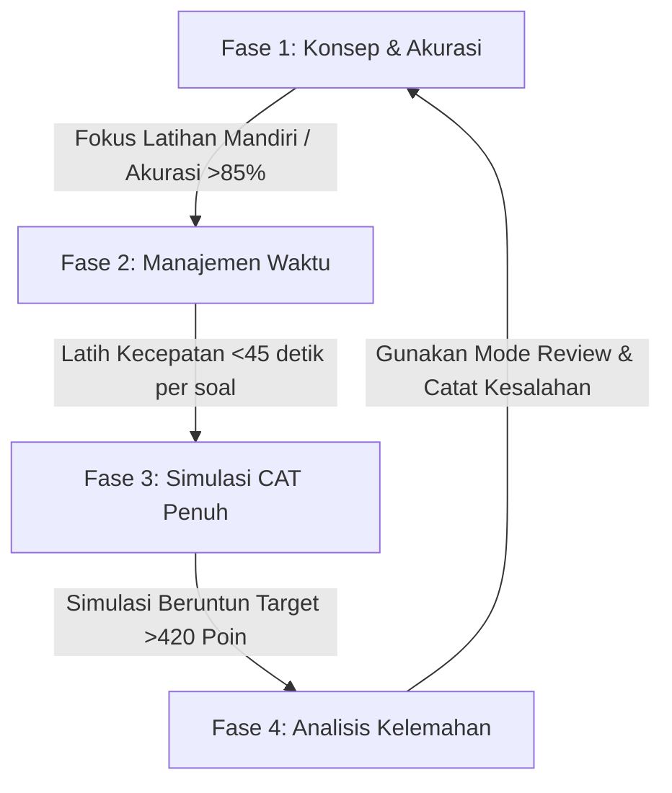

# 🎯 AksaraCAT — Akselerasi Belajar CAT CPNS

AksaraCAT adalah platform simulasi dan latihan ujian Computer Assisted Test (CAT) CPNS modern, premium, bebas iklan, dan offline-first. Proyek ini dirancang untuk **mempercepat feedback loop** bagi calon peserta ujian dalam memahami pola soal dan materi SKD (Seleksi Kompetensi Dasar) secara interaktif.

---

## 🚀 Fitur Utama

- **Feedback Loop Instan**: Dalam mode latihan mandiri, Anda akan langsung mendapatkan status jawaban (benar/salah) beserta pembahasan detail begitu mengklik salah satu pilihan jawaban.
- **Simulasi CAT Standar BKN**: Uji kesiapan Anda dengan simulasi CAT penuh (110 soal acak: 30 TWK, 35 TIU, 45 TKP) dengan timer 100 menit dan kalkulasi kelulusan otomatis berdasarkan batas *Passing Grade* resmi.
- **AI-Native (Laravel 13 AI SDK)**: Menggunakan package resmi `laravel/ai` di backend untuk pengembangan fitur masa depan seperti generate pembahasan otomatis, tanya-jawab materi, dan penilai jawaban analitis.
- **Offline-First PWA (Progressive Web App)**: Sekali dimuat, AksaraCAT dapat diinstal di smartphone/desktop dan diakses secara offline penuh tanpa memerlukan koneksi internet.
- **Database Terintegrasi (PostgreSQL)**: Dilengkapi dengan 402 bank soal unik siap pakai yang di-seed otomatis saat inisialisasi kontainer.

---

## 🛠️ Stack Teknologi

- **Frontend**: Vue 3 + TypeScript + Vite + Framework7 9.0.5 (Mobile-First, smooth animations & Type-Safe)
- **Backend API**: Laravel 13 (PHP 8.3+) + Official `laravel/ai` SDK
- **Database**: PostgreSQL 16
- **Kontainerisasi**: Docker & Docker Compose (Coolify-ready)


## 🏆 Rekomendasi Strategi Belajar & User Journey (Target 420+ Poin)

Dalam persaingan seleksi CPNS, sekadar melewati batas kelulusan minimal (*Passing Grade* resmi BKN 311 poin) hampir dipastikan **tidak akan lolos** ke tahap SKB (Seleksi Kompetensi Bidang) karena aturan perangkingan nasional (hanya meloloskan top 3 kali formasi). Target aman ril peserta untuk menjamin kelulusan formasi adalah **420+ poin**.

Berikut adalah rancangan optimalisasi *User Journey* belajar dan strategi penggunaan aplikasi AksaraCAT untuk mencapai target tersebut:

### 1. Metrik Kunci Kecepatan vs Akurasi
BKN memberikan waktu **100 menit untuk 110 soal**, yang berarti rata-rata **54 detik per soal**. Oleh karena itu, *Riwayat Hasil Belajar* di AksaraCAT harus memantau dua metrik utama ini secara berkala:
*   **Akurasi Rata-rata (Target >85%)**: Menunjukkan kekuatan pemahaman konsep dasar (terutama TWK dan TIU).
*   **Kecepatan Rata-rata per Soal (Target <45 detik/soal)**: Menjamin sisa waktu aman untuk meninjau kembali soal-soal sulit/ragu-ragu dan mengunci poin maksimal.

### 2. Pentahapan User Journey Belajar (4 Tahap Menuju 420+)



*   **Fase 1: Penguasaan Konsep & Akurasi (Akurasi >85%)**
    *   **Metode**: Gunakan modul **Latihan Mandiri Per Kategori** (Sinonim, Deret, Analogi, dll.).
    *   **Fokus**: Manfaatkan fitur *Instant Feedback loop*. Setiap kali menjawab, telaah pembahasannya baik jawaban Anda benar maupun salah. Jangan terburu-buru dengan waktu pada tahap ini.
*   **Fase 2: Kecepatan & Efisiensi Pengerjaan (Waktu <45s / soal)**
    *   **Metode**: Mulai aktifkan mode simulasi berwaktu pada paket-paket kecil.
    *   **Fokus**: Melatih refleks pengerjaan. Jika soal TIU numerik terasa memakan waktu lebih dari 1 menit, langsung tandai *Ragu-ragu* dan lewati.
*   **Fase 3: Simulasi CAT Kompetitif (Skor Target >420)**
    *   **Metode**: Jalankan modul **Simulasi CAT SKD** penuh (110 soal acak).
    *   **Fokus**: Kerjakan simulasi berulang kali sampai nilai stabil di atas 420 poin dengan distribusi skor target:
        *   **TWK**: >95 poin (Min. 19/30 soal benar)
        *   **TIU**: >130 poin (Min. 26/35 soal benar)
        *   **TKP**: >195 poin (Bobot poin tinggi, kumpulkan rata-rata skor 4.3 dari 5 per soal)
*   **Fase 4: Analisis Kelemahan Mendalam**
    *   **Metode**: Buka menu **Riwayat Hasil Belajar** dan gunakan **Review Mode** pada simulasi yang gagal mencapai target.
    *   **Fokus**: Catat jenis soal/topik spesifik yang paling sering salah (misal: Figural Analogi atau TWK Bela Negara) lalu kembali ke Fase 1 untuk topik tersebut.

### 3. Trik Taktis Pengerjaan BKN CAT
1.  **Dahulukan TKP (35-40 Menit)**: Soal TKP tidak memiliki nilai minus dan jawaban terburuk pun tetap mendapat 1 poin (skor 1-5). Selesaikan 45 soal TKP terlebih dahulu untuk mengamankan minimal 180+ poin dasar.
2.  **TWK Kilat (15-20 Menit)**: TWK hanya menguji hafalan dan pemahaman pilar negara (benar 5, salah 0). Jawab dengan cepat tanpa ragu; jika tidak tahu, tebak secara terdidik karena tidak ada nilai minus.
3.  **Sisa Waktu untuk TIU (40-45 Menit)**: Dedikasikan sisa waktu terbanyak untuk TIU yang membutuhkan corat-coret matematis dan penalaran analitis mendalam.

---

## 🗺️ Skema Relasional Database

Database PostgreSQL menggunakan relasi **Many-to-Many** untuk memetakan soal ke masing-masing sub-kategori/topik tanpa menduplikasi data soal:

```
packets (Daftar Topik/Paket)
 └── packet_bank_soal (Tabel Pivot Relasi Many-to-Many)
      └── bank_soals (402 Soal Unik Ter-deduplikasi)
```

---

## 📊 Representasi Data Tabel (Contoh Baris PostgreSQL)

Berikut adalah visualisasi struktur lengkap seluruh kolom database beserta contoh baris data ril dari PostgreSQL kita:

### 1. Tabel `packets` (Daftar Paket/Topik)
| id | kategori | judul | jenis | waktu_menit | created_at | updated_at |
|---|---|---|---|---|---|---|
| **13** | `TIU` | Sinonim | latihan | *NULL* | `2026-06-18 07:33:49` | `2026-06-18 07:33:49` |
| **15** | `TIU` | Figural 1 | latihan | *NULL* | `2026-06-18 07:33:49` | `2026-06-18 07:33:49` |

### 2. Tabel `bank_soals` (Bank Soal Unik)
Tabel ini disajikan secara vertikal untuk keterbacaan optimal karena memiliki **25 kolom** yang terisi penuh dari data hasil scraping:

| Nama Kolom | Tipe Data | Contoh Baris A (ID: 91 - Teks) | Contoh Baris B (ID: 180 - Gambar) |
|---|---|---|---|
| **id** | `BIGINT (PK)` | `91` | `180` |
| **kategori** | `VARCHAR(10)` | `TIU` | `TIU` |
| **soal** | `TEXT` | `KAUSAL` | `Perhatikan gambar dibawah ini ! Pilihlah satu gambar yang paling tepat.` |
| **img_soal** | `TEXT` | *NULL / Kosong* | `https://blogger.googleusercontent.com/img/b/R29vZ2xl/AVvXsEgnRUQL-BCS7oALtthrVppM1trVZclJCnRtOFOssOUawSjOxaQviF70bCC8n3mvu1ELXCPeRVJOmyP4zbNlyi9fx8ujqtcY0cbMKwPw5iO-xIg229xaGuSaNX16fLCYEBLmLHXR0gVybDeC8fJP9EcpDZ0cR16F6x_sQgOlMzuSJxp3ZGyDQ80XPMmXsQ/s541/soal.jpg` |
| **a** | `TEXT` | `Sebab Akibat` | `a` |
| **b** | `TEXT` | `Untung Rugi` | `b` |
| **c** | `TEXT` | `Menang Kalah` | `c` |
| **d** | `TEXT` | `Besar Kecil` | `d` |
| **e** | `TEXT` | `Naik Turun` | `e` |
| **img_a** | `TEXT` | *NULL / Kosong* | `https://blogger.googleusercontent.com/img/b/R29vZ2xl/AVvXsEgL-SuackYasYHcrYD84jtf9FcpOmyTfE3n9I0p-mNc59HgvdYDD-Zu-kLK9IKfrvnXSDmuk880KfeTzu4UiMHN-3nKR3V8MnRxPSij_xRFGHu45RrNPQBYyj4F5ADcr0HSBZm3sLhK_SUc9zkcUZuAoi-sEynkgZmhoNrHzu6IE_6PBcxxR3IhsT9vKw/s140/a.jpg` |
| **img_b** | `TEXT` | *NULL / Kosong* | `https://blogger.googleusercontent.com/img/b/R29vZ2xl/AVvXsEh1lG4Ve6liH70YSi8UhnwQ71v_Toyd6PXV7nrrQidv6jIatZ8VuNg9zJ8T-gGK7Ixtydy7qoTauSB3R9CaPOEJc_webhHJy-mA_DEEGCHK8ZY2ODxTTA97_oAaIDoZrAjKfNyr1ukjndKDCAkcKyd2Z_e2_w9FNckzAPFlWlyVLrZWH75RGGTqdIp1LA/s140/b.jpg` |
| **img_c** | `TEXT` | *NULL / Kosong* | `https://blogger.googleusercontent.com/img/b/R29vZ2xl/AVvXsEiL-HSr7L9ByIGMYR8mWyiz3FNX5mhDThUMPrhzc3FJBYxifOpcS2QpTf6hUZgd4yrt2Be0KYe02dgrW8mxrFqGw774qZh-MawUbe1CVw7i0Mmys2CByAV6vkCtRXp5BLP79d6zm_pBioewHLV8jjtQVmlKRyKoKdc0d0yoTY0AkorHlZ33HOIO2fqUpg/s140/c.jpg` |
| **img_d** | `TEXT` | *NULL / Kosong* | `https://blogger.googleusercontent.com/img/b/R29vZ2xl/AVvXsEgNK6ALD3jPAhTQ2zNhdeTzOYVPn2ZIh9626RFKMkHvlZoIUXAUZBr_1x0i-LLJGQKc3jPUZLmyZHizb7PoHFL70Km7f-r2Q5yn1RjGc6RKzGntqeJ1k7jaWAvWozN1TJRf-DPx2xYUa25zAuPlowm4_xvkRtVzSZwgpT7q8vx0Jb1rL5qWPBVmAcWPUg/s140/d.jpg` |
| **img_e** | `TEXT` | *NULL / Kosong* | `https://blogger.googleusercontent.com/img/b/R29vZ2xl/AVvXsEhurOsypabOe7ceOzTIV5i0L8NoZlud9JmRFtlWBzq39oHRqqrLMdwzWF3Mny-BZp0BXQi6aUdVJK5WtC_PW9zobXeIXiolfK7J8LBRdvbz244OMMECh83dQI-bdvUZTGHb_kuL8JKX-9KNhkTHWMYPlWYeXOLmWSu1Dr539bGvZMusiKNKJuEMU4ln1A/s140/e.jpg` |
| **kunci** | `CHAR(1)` | `A` | `B` |
| **jawaban_benar** | `TEXT` | `Sebab Akibat` | `b` |
| **skor_a** | `INTEGER` | `5` | `0` |
| **skor_b** | `INTEGER` | `0` | `5` |
| **skor_c** | `INTEGER` | `0` | `0` |
| **skor_d** | `INTEGER` | `0` | `0` |
| **skor_e** | `INTEGER` | `0` | `0` |
| **pembahasan** | `TEXT` | `Kata kausal menunjukan hubungan yang bersebab akibat` | *NULL / Kosong* |
| **gambar_pembahasan**| `TEXT` | *NULL / Kosong* | `https://blogger.googleusercontent.com/img/b/R29vZ2xl/AVvXsEify91-XHDMEq9WtId7UTho7F2Bxhjlqr1Oymw7DWpXWjmCm1IYHJvQpwOKmlR8uRLrmQC9iaGeNwhq7m4msp7J7jBAsJxYlpry0T98naKGMW-B9har7NA--GykMfqBR_yrzc_9TUSw79kcaUN60vAxSfntoWiN4XHoZ8wEf0VX4R6t2D-AnYjAxo41_A/s528/pembahasan.jpg` |
| **created_at** | `TIMESTAMP` | `2026-06-18 07:33:47` | `2026-06-18 07:33:48` |
| **updated_at** | `TIMESTAMP` | `2026-06-18 07:33:47` | `2026-06-18 07:33:48` |

### 3. Tabel Pivot `packet_bank_soal` (Relasi)
| packet_id | bank_soal_id |
|---|---|
| **13** *(Sinonim)* | **91** *(KAUSAL)* |
| **15** *(Figural 1)* | **180** *(Gambar Figural)* |

---

## 💻 Cara Menjalankan Development Server

Untuk memulai development server di laptop Anda secara seamless tanpa meninggalkan kontainer atau proses yatim (*orphan process*), cukup jalankan skrip berikut di root folder:

```bash
./dev.sh
```

Skrip ini akan secara otomatis:
1. Membangun dan menyalakan kontainer Docker (PostgreSQL, Laravel API, Vue Vite).
2. Menunggu database siap menerima koneksi.
3. Menjalankan *migration* database relasional dan memasukkan 402 bank soal CPNS beserta relasi paketnya secara otomatis (*seeding*).
4. Menampilkan URL lokal Anda.
5. **Membersihkan Port & Containers**: Ketika Anda menekan `Ctrl+C`, skrip akan secara otomatis mematikan semua service secara bersih (`docker compose down`) sehingga tidak mengganggu resource laptop Anda.

**URL Akses Lokal:**
- **Frontend App**: `http://localhost:5173`
- **Backend API**: `http://localhost:8000`

---

## 🧹 Pemeliharaan & Kualitas Kode (TypeScript & Linting)

Kami menerapkan penulisan kode modern yang ketat di sisi frontend dengan pengawasan tipe dan linter secara otomatis:

*   **Pengecekan Tipe Statis (Type-checking)**:
    ```bash
    docker compose exec frontend bun run typecheck
    ```
*   **Pengecekan Kode (ESLint Flat Config v9+)**:
    ```bash
    docker compose exec frontend bun run lint
    ```
*   **Perbaikan Linter Otomatis (Autofix)**:
    ```bash
    docker compose exec frontend bun run lint:fix
    ```
*   **Kompilasi Produksi (Production Build)**:
    ```bash
    docker compose exec frontend bun run build
    ```


---

## 📦 Deployment ke Coolify

Repositori ini siap diintegrasikan dengan aplikasi **Coolify** (alternatif open-source Heroku/Vercel) untuk autodeploy otomatis:
1. Hubungkan repositori GitHub Anda ke dashboard Coolify.
2. Buat resource baru bertipe **Docker Compose** di Coolify.
3. Tempel konfigurasi [docker-compose.yml](file:///home/ihza/projects/cpns/docker-compose.yml) atau biarkan Coolify mendeteksinya secara otomatis.
4. Jangan lupa untuk memasukkan API Key AI Provider Anda (misal `GEMINI_API_KEY` atau `OPENAI_API_KEY`) pada bagian environment variables di Coolify untuk mengaktifkan AI SDK Laravel.
